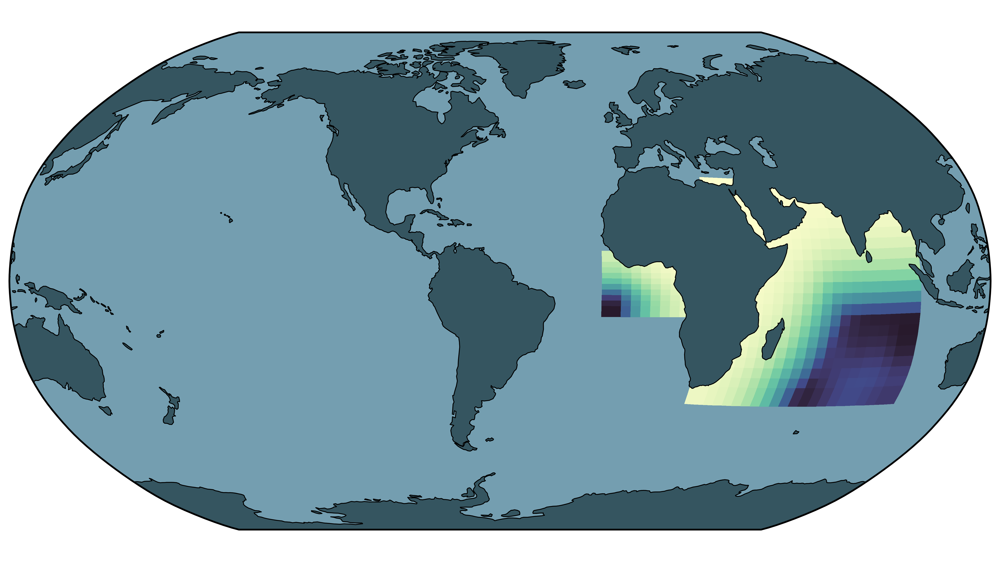

# C-SON Forge

A utility for generating new regional oceanographic modeling domains and creating reproducible [C-Star](https://c-star.readthedocs.io) workflows through blueprint descriptors.

## The C-Star Ocean Network

  

- [Oveview](workflows/docs_overview.md)
- [Installation instructions](workflows/docs_installation.md)
- [Domain creation oveview](workflows/grid_index.md)
- [Analysis](workflows/analysis_index.md)
